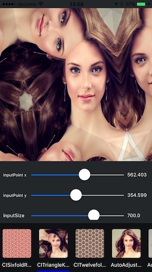

# Cmg

[](https://developer.apple.com/swift/)
[](https://developer.apple.com/swift/)
[](https://developer.apple.com/swift/)


Easy image filtering library of using Core Image. (CIFilter)

Cmg is inspired by [Filterpedia](https://github.com/FlexMonkey/Filterpedia).

## Requirements

* Xcode 7.1+
* iOS 8.0+
* Swift 2.1+

## Features

- Image filtering (use CIFilter)
- Filter grouping
- Filter chaining
- Slider support
- Face detection (bonus)

## Usage

### Basics

Example for GaussianBlur filter

Default filter
```swift
let filteredImage = GaussianBlur().processing(image)
```

Edit for filter parameter

```swift
var filter = GaussianBlur()
filter.radius = 15.0
let filteredImage = filter.processing(image)
```

Edit for filter parameter (using closure)

```swift
let filteredImage = GaussianBlur()
      .configuration(){ filter in filter.inputRadius.setValue(15) }
      .processing(image)
```

### Filter Group

```swift
let filterGroup = FilterGroup(name: "FilterGroupExample", [
    BoxBlur().configuration({ filter in filter.inputRadius.setValue(15) }),
    Vignette(),
    PhotoEffectMono(),
    ])

let filteredImage = filterGroup.processing(image)
```

### Filter Chaining

```swift
let filteredImage = image.cmg_chain([
    ComicEffect(),
    GaussianBlur().configuration({ filter in
        filter.inputRadius.setValue(15)
    }),
    PerspectiveTile(imageSize: image.size).configuration({ filter in
        filter.inputTopLeft.setVector(Vector2(x: 118.0, y: 490.0).ciVector)
    }),
    ])
```

## Demo

Please see Demo project. (Support Filter ShowCase)
Please try on iOS Devices.
Simulator is very slow...



## Installation

### CocoaPods

Cmg is available through [CocoaPods](http://cocoapods.org). To install
it, simply add the following line to your Podfile:

```ruby
use_frameworks!

pod "Cmg"
```

### Carthage

To integrate Chain into your Xcode project using Carthage, specify it in your Cartfile:

```ruby
github "xxxAIRINxxx/Cmg"
```

## Use Image

Thanks [pixabay](https://pixabay.com/)

## License

MIT license. See the LICENSE file for more info.
